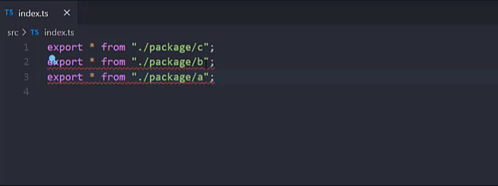

# eslint-plugin-sort-export-all

ESLint rule that sorts `exports *` with autofix enabled



## Installation

You'll first need to install [ESLint](http://eslint.org):

```
$ yarn add eslint --dev
$ npm i eslint --save-dev
```

Next, install `eslint-plugin-sort-export-all`:

```
$ yarn add eslint-plugin-sort-export-all --dev
$ npm install eslint-plugin-sort-export-all --save-dev
```

**Note:** If you installed ESLint globally (using the `-g` flag) then you must also install `eslint-plugin-sort-export-all` globally.

## Usage

Add `sort-export-all` to the plugins section of your `.eslintrc` configuration file. You can omit the `eslint-plugin-` prefix:

```json
{
  "plugins": ["sort-export-all"]
}
```

Then add `sort-export-all` rule under the rules section.

```json
{
  "rules": {
    "sort-export-all/sort-export-all": "warn"
  }
}
```

Often it makes sense to enable `sort-export-all` only for certain files/directories. For cases like that, use override key of eslint config:

```jsonc
{
  "plugins": ["sort-export-all"],
  "rules": {
    "sort-export-all/sort-export-all": "off"
  },
  "overrides": [
    {
      "files": ["src/**/index.{ts,js}"],
      "rules": {
        "sort-export-all/sort-export-all": "error
      }
    }
  ]
}
```

## Rule configuration

- The 1st option is `"asc"` or `"desc"`.

  `"asc"` (default) - enforce properties to be in ascending order.

  `"desc"` - enforce properties to be in descending order.

- The 2nd option is an object which has 3 properties.

  `caseSensitive` - if `true`, enforce properties to be in case-sensitive order. Default is `true`.

  `natural` - if `true`, enforce properties to be in natural order. Default is false. Natural Order compares strings containing combination of letters and numbers in the way a human being would sort. It basically sorts numerically, instead of sorting alphabetically. So the number 10 comes after the number `3` in Natural Sorting.

  ```
  Standard sorting:   Natural order sorting:
      img1.png            img1.png
      img10.png           img2.png
      img12.png           img10.png
      img2.png            img12.png
  ```

The default config is

```javascript
[
  "warn",
  "asc",
  {
    caseSensitive: true,
    natural: false,
  },
];
```
