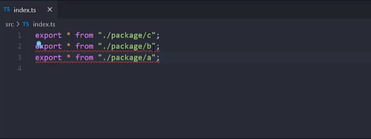

# sort-export-all

ESLint rule that sorts `exports *` with autofix enabled

💼 This rule is enabled in the ✅ `recommended` [config](https://github.com/nirtamir2/eslint-plugin-sort-destructure-keys-typescript/blob/main/src/config.ts).

🔧💡 This rule is automatically fixable by the [`--fix` CLI option](https://eslint.org/docs/latest/user-guide/command-line-interface#--fix) and manually fixable by [editor suggestions](https://eslint.org/docs/latest/use/core-concepts#rule-suggestions).



## Rule Details

<!-- eslint-skip -->

```js
// 👎 Bad
export * from "./a";
export * from "./b";
```

<!-- eslint-skip -->

```js
// 👍 Good
export * from "./b";
export * from "./a";
```

## Rule configuration

- The 1st option is `"asc"` or `"desc"`.

  `"asc"` (default) - enforce properties to be in ascending order.

  `"desc"` - enforce properties to be in descending order.

- The 2nd option is an object which has 3 properties.

  `caseSensitive` - if `true`, enforce properties to be in case-sensitive order. Default is `true`.

  `natural` - if `true`, enforce properties to be in natural order. Default is false. Natural Order compares strings containing a combination of letters and numbers in the way a human being would sort. It basically sorts numerically, instead of sorting alphabetically. So the number 10 comes after the number `3` in Natural Sorting.

```

Standard sorting: Natural order sorting:
img1.png img1.png
img10.png img2.png
img12.png img10.png
img2.png img12.png

```

The default config is

```javascript
[
  "warn",
  "asc",
  {
    caseSensitive: true,
    natural: false,
  },
];
```
